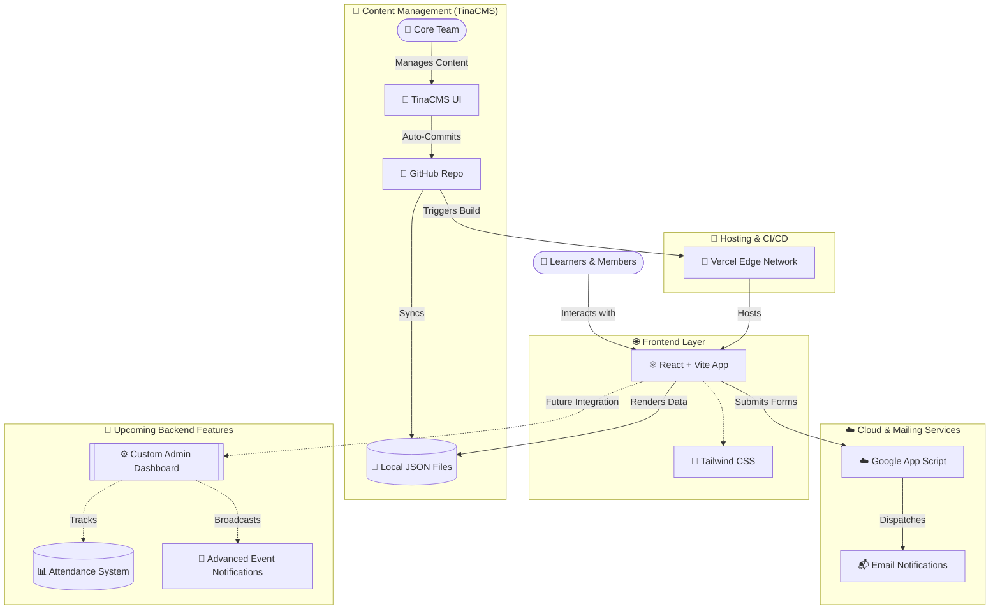

<div align="center">
  
  <h1>ByteCode Learners 🚀</h1>
  <p><b>A vibrant community of passionate learners and developers.</b></p>
  <p>🏢 <b>Head Office:</b> Department of Computer Science & Engineering, <br> School of Engineering and Technology (SOET), Central University of Haryana</p>
</div>

---

## 📊 Community Stats
<!-- tina-stats-start -->
<div align="center">
  <table width="100%">
    <tr>
      <td align="center">
        <h3>💻 Lines Committed</h3>
        <h2>70k+</h2>
      </td>
      <td align="center">
        <h3>👨‍💻 Active Learners</h3>
        <h2>150+</h2>
      </td>
      <td align="center">
        <h3>🔴 Live Events</h3>
        <h2>4</h2>
      </td>
      <td align="center">
        <h3>🏆 Kernel Achievements</h3>
        <h2>17</h2>
      </td>
    </tr>
  </table>
</div>
<!-- tina-stats-end -->

---

## 📅 Upcoming & Past Events
<!-- tina-events-start -->
<table width="100%">
  <tr>
    <th align="left">Event</th>
    <th align="left">Date</th>
    <th align="left">Location</th>
    <th align="left">Tag</th>
  </tr>
  <tr>
    <td><b>ByteCode Coding Night</b></td>
    <td>28 MAR 26</td>
    <td>ONLINE_MODE</td>
    <td><code>DSA</code></td>
  </tr>
  <tr>
    <td><b>C++ Bootcamp</b></td>
    <td>07 FEB 26</td>
    <td>AB-4 Room 231</td>
    <td><code>C++</code></td>
  </tr>
  <tr>
    <td><b>Git & GitHub Mastery</b></td>
    <td>21 MAR 26</td>
    <td>SOET Room 24</td>
    <td><code>Git</code></td>
  </tr>
  <tr>
    <td><b>IOT Systems Session</b></td>
    <td>05 APR 26</td>
    <td>AB-4 Room 231</td>
    <td><code>IoT</code></td>
  </tr>
</table>
<!-- tina-events-end -->

---

## 💻 Projects
<!-- tina-projects-start -->
### [BYTECODE LEARNERS](https://github.com/bytecode-learners/bytecode-learners)
> The official digital hub for the Bytecode Learners coding club. This Git-backed CMS platform serves as a central registry for events, member contributions, and technical resources, fostering a collaborative ecosystem for developers.

**Tech:** React, Vite, Tailwind CSS, TinaCMS<br>
**Status:** Active | **Version:** v1.0.0

### [MESS MATE](https://github.com/stikhead/MessMate.git)
> A specialized management solution designed to streamline hostel mess operations. Developed by Anirudh Bansal, this platform solves real-world logistics and feedback issues, currently optimized for high-efficiency throughput in campus dining.

**Tech:** React, Node.js, Express, MongoDB, Typescript<br>
**Status:** Beta | **Version:** v0.1.0-beta
<!-- tina-projects-end -->

---

## 👥 Our Team
<!-- tina-team-start -->
<div align="center">

### 👑 Leadership

<table width="100%">
<tr>

<td align="center" colspan="1">
  <a href="https://github.com/Martian745">
    
    <br />
    <sub><b>AZAD</b></sub>
  </a>
  <br />
  <i>TEAM LEAD</i>
</td>
<td align="center" colspan="1">
  <a href="https://github.com/Vibhuti-Singhal">
    
    <br />
    <sub><b>VIBHUTI SINGHAL</b></sub>
  </a>
  <br />
  <i>CO-TEAM LEAD</i>
</td>
<td align="center" colspan="1">
  <a href="https://github.com/vikasingh0897">
    
    <br />
    <sub><b>VIKAS SINGH</b></sub>
  </a>
  <br />
  <i>TECH LEAD</i>
</td>
<td align="center" colspan="1">
  <a href="https://github.com/manasthakur13">
    
    <br />
    <sub><b>MANAS THAKUR</b></sub>
  </a>
  <br />
  <i>CO-TECH LEAD</i>
</td>
</tr>
<tr>

<td align="center" colspan="1">
  <a href="https://github.com/ri29ya21">
    
    <br />
    <sub><b>RIYA KUMARI</b></sub>
  </a>
  <br />
  <i>MARKETING LEAD</i>
</td>
<td align="center" colspan="1">
  <a href="https://github.com/ShrutiChoudhary-23">
    
    <br />
    <sub><b>SHRUTI CHOUDHARY</b></sub>
  </a>
  <br />
  <i>EVENT MANAGER</i>
</td>
<td align="center" colspan="1">
  <a href="https://github.com/shivgobindmourya">
    
    <br />
    <sub><b>SHIV GOBIND</b></sub>
  </a>
  <br />
  <i>DESIGN LEAD</i>
</td>
<td align="center" colspan="1">
  <a href="https://github.com/gytdrop">
    
    <br />
    <sub><b>AKTHAR SHAIK</b></sub>
  </a>
  <br />
  <i>CREATIVE LEAD</i>
</td>
</tr>
<tr>

<td align="center" colspan="2">
  <a href="https://github.com/Simranwatts">
    
    <br />
    <sub><b>SIMRAN WATTS</b></sub>
  </a>
  <br />
  <i>SOCIAL MEDIA MANAGER</i>
</td>
<td align="center" colspan="2">
  <a href="https://github.com/tushartandon99">
    
    <br />
    <sub><b>TUSHAR TANDON</b></sub>
  </a>
  <br />
  <i>FINANCE MANAGER</i>
</td>
</tr>
</table>

### 🌟 Core Contributors

<table width="100%">
<tr>

<td align="center" colspan="2">
  <a href="https://github.com/stikhead">
    
    <br />
    <sub><b>ANIRUDH BANSAL</b></sub>
  </a>
  <br />
  <i>CORE CONTRIBUTOR</i>
</td>
<td align="center" colspan="2">
  <a href="https://github.com/princeag1652">
    
    <br />
    <sub><b>PRINCE AGARWAL</b></sub>
  </a>
  <br />
  <i>CORE CONTRIBUTOR</i>
</td>
</tr>
</table>
</div>
<!-- tina-team-end -->

---

## 🛠️ Tech Stack & Architecture

<div align="center">
  
  
  
  
  
</div>

<br>

> **Architecture Note:** ByteCode Learners uses a decoupled Git-backed headless CMS architecture. Content is stored directly in JSON files within the `content/` directory and managed seamlessly through **TinaCMS**, providing an optimal developer and editor experience.

### 🏛️ System Architecture



> **🚧 Work in Progress:** We are currently working on a robust backend integration to introduce an advanced **Admin Control Panel**. This upcoming update will seamlessly handle **attendance tracking**, **automated event notifications**, and other powerful administrative features to scale the ByteCode Learners community operations!

---

## 🚀 Quick Start (Running Locally)

Get up and running with the ByteCode Learners platform in seconds!

<details>
<summary><b>Show Instructions</b></summary>
<br>

**1️⃣ Install Dependencies**
```bash
npm install
```

**2️⃣ Launch the Local Server**
```bash
npm run dev
```
> 💡 *Note: This command elegantly fires up both the Vite development server for the frontend and the local TinaCMS backend for content management.*

**3️⃣ Production Build**
```bash
npm run build
```

</details>

---

<div align="center">
  <h3>Let's Connect! 🌐</h3>
  <a href="https://github.com/ByteCode-Learners"></a>
  <a href="https://www.linkedin.com/company/bytecodelearners"></a>
  <a href="https://www.instagram.com/bytecodelearners"></a>
  
  <br/>
</div>

---

<div align="center">

## 👨‍💻 Developer & Credits

  <table width="50%">
    <tr>
      <td align="center">
        <a href="https://github.com/vikasingh0897">
          
          <br />
          <b>Vikas Singh</b>
        </a>
        <i>Creator & Maintainer</i>
        <br /><br />
        <a href="https://github.com/vikasingh0897"></a>
        <a href="https://www.linkedin.com/in/vikasingh0897/"></a>
      </td>
    </tr>
  </table>
  <p>This project and community platform was developed and is maintained with ❤️ by <b>Vikas Singh</b>.</p>
</div>